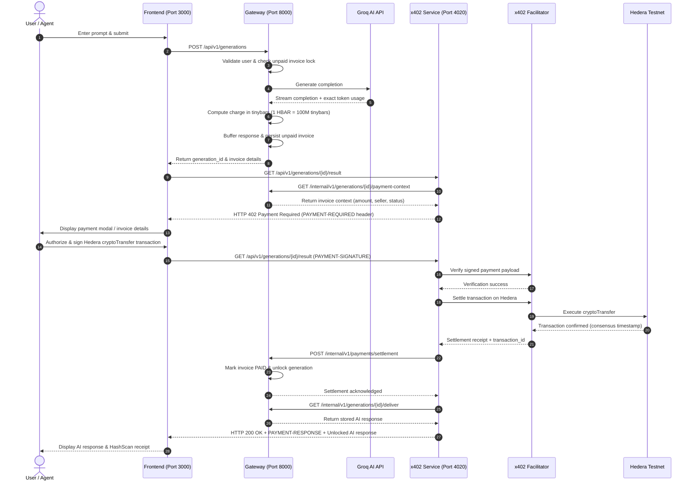

# PerPay Payment Flow — x402 v2 & Hedera Testnet

## End-to-End Payment Lifecycle

```mermaid
sequenceDiagram
    autonumber
    actor User as User / Agent
    participant FE as Frontend (Port 3000)
    participant GW as Gateway (Port 8000)
    participant Groq as Groq AI API
    participant X402 as x402 Service (Port 4020)
    participant Fac as x402 Facilitator
    participant Hedera as Hedera Testnet

    User->>FE: Enter prompt & submit
    FE->>GW: POST /api/v1/generations
    GW->>GW: Validate user & check unpaid invoice lock
    GW->>Groq: Generate completion
    Groq-->>GW: Stream completion + exact token usage
    GW->>GW: Compute charge in tinybars (1 HBAR = 100M tinybars)
    GW->>GW: Buffer response & persist unpaid invoice
    GW-->>FE: Return generation_id & invoice details
    
    FE->>X402: GET /api/v1/generations/{id}/result
    X402->>GW: GET /internal/v1/generations/{id}/payment-context
    GW-->>X402: Return invoice context (amount, seller, status)
    X402-->>FE: HTTP 402 Payment Required (PAYMENT-REQUIRED header)
    
    FE->>User: Display payment modal / invoice details
    User->>FE: Authorize & sign Hedera cryptoTransfer transaction
    FE->>X402: GET /api/v1/generations/{id}/result (PAYMENT-SIGNATURE)
    X402->>Fac: Verify signed payment payload
    Fac-->>X402: Verification success
    X402->>Fac: Settle transaction on Hedera
    Fac->>Hedera: Execute cryptoTransfer
    Hedera-->>Fac: Transaction confirmed (consensus timestamp)
    Fac-->>X402: Settlement receipt + transaction_id
    
    X402->>GW: POST /internal/v1/payments/settlement
    GW->>GW: Mark invoice PAID & unlock generation
    GW-->>X402: Settlement acknowledged
    X402->>GW: GET /internal/v1/generations/{id}/deliver
    GW-->>X402: Return stored AI response
    X402-->>FE: HTTP 200 OK + PAYMENT-RESPONSE + Unlocked AI response
    FE-->>User: Display AI response & HashScan receipt
```

